# All images (26 committed raster files)

Single-page gallery; paths are relative to the repo root. Notebook-only figures are not included until exported.

## docs/assets

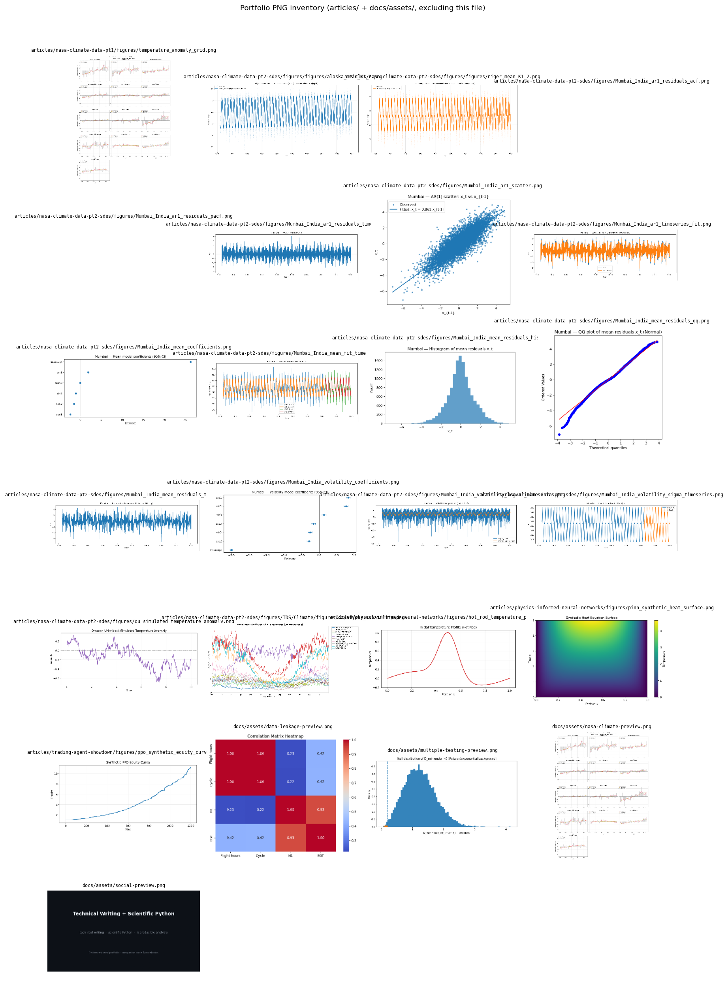

## NASA climate Pt. 1

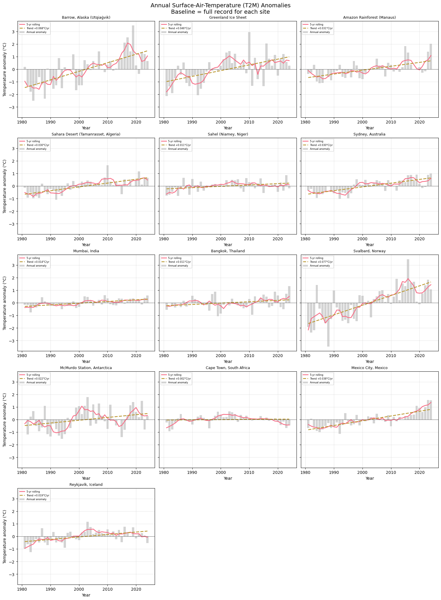

## NASA climate Pt. 2 (SDEs)

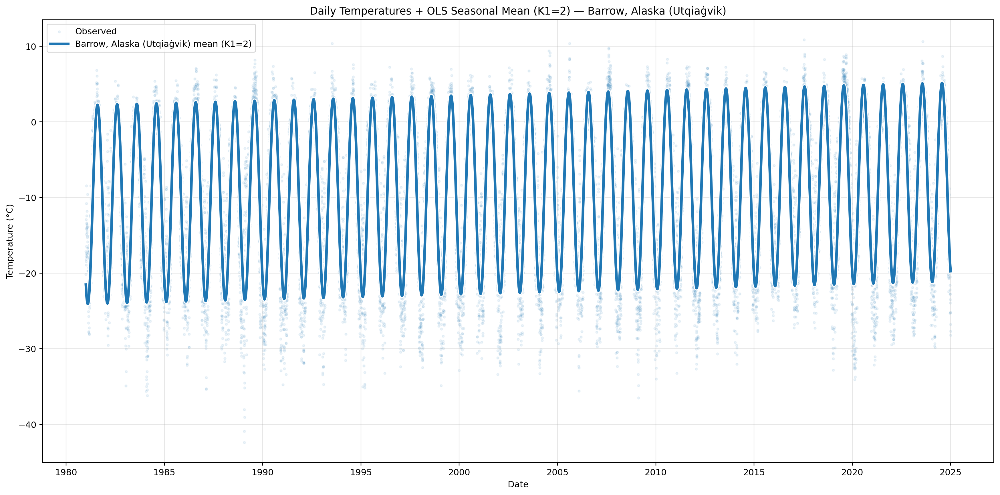

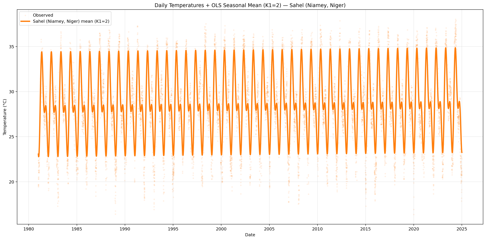

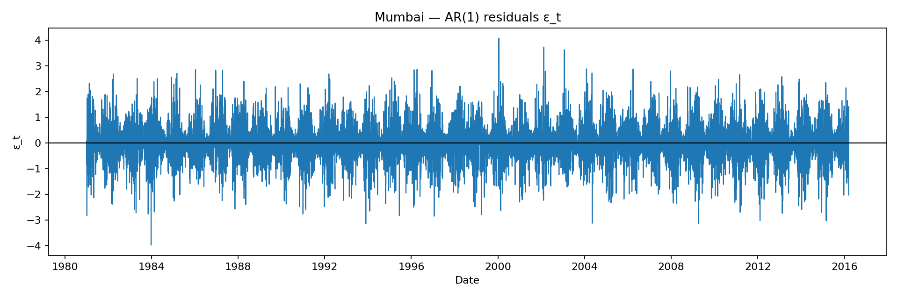

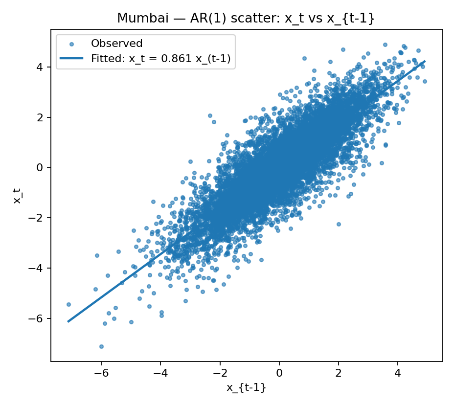

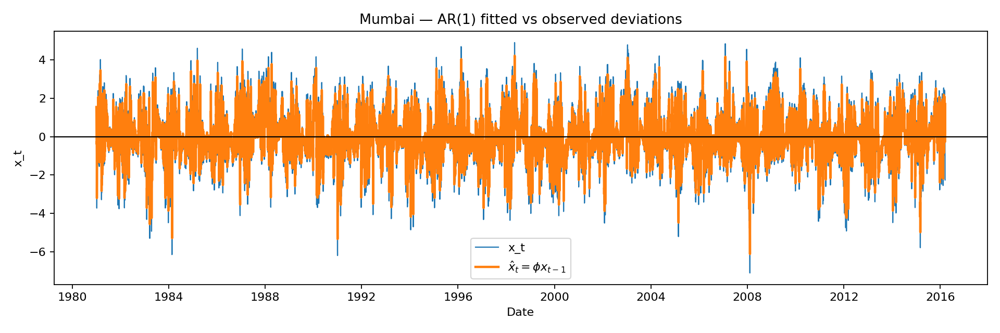

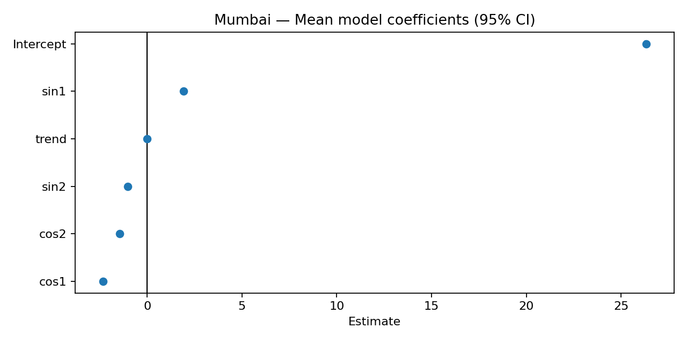

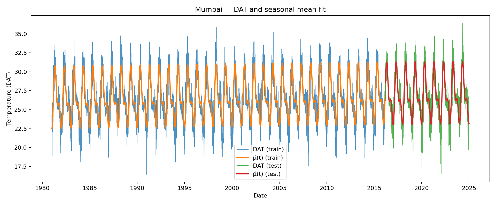

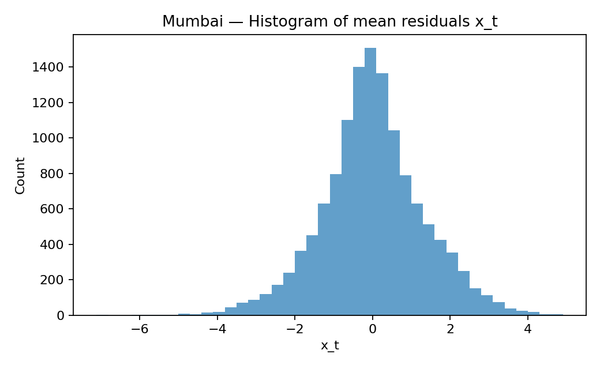

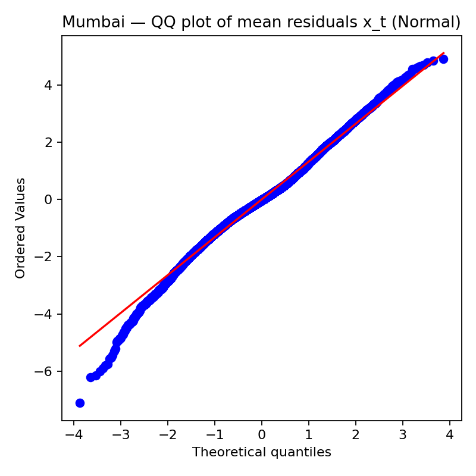

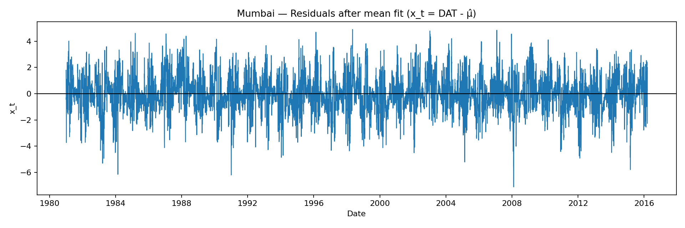

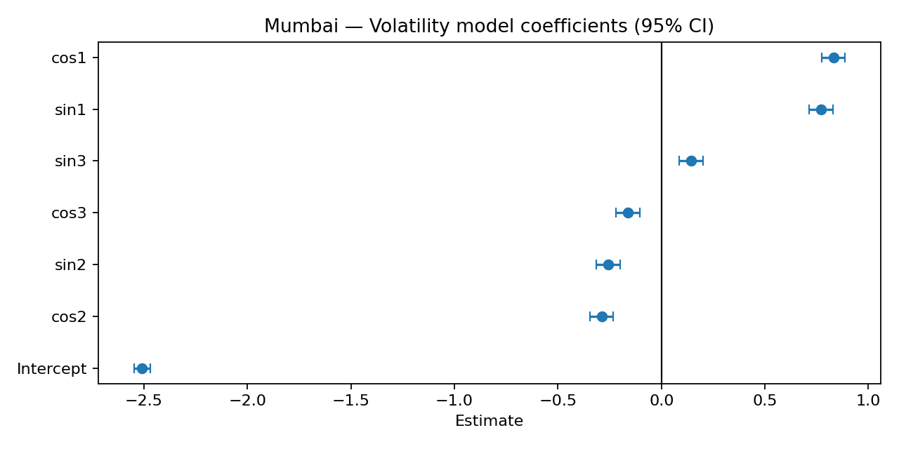

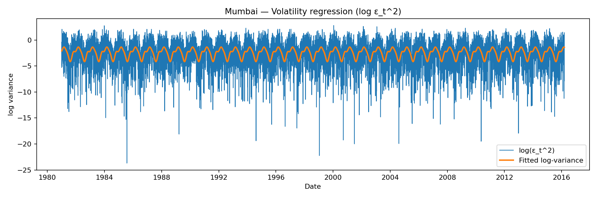

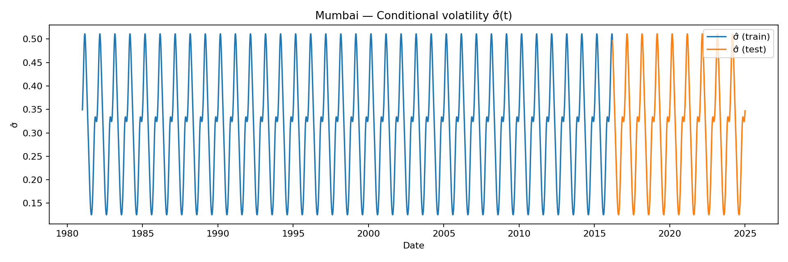

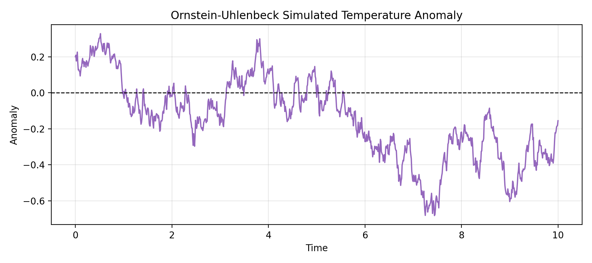

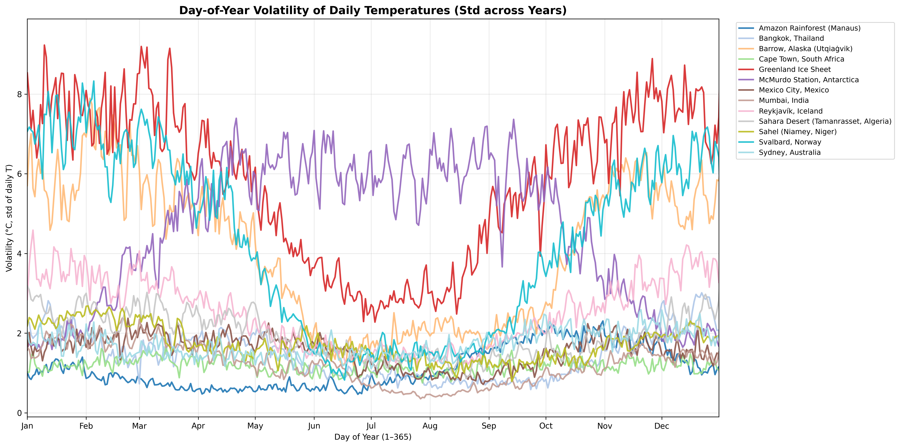

## Physics-informed neural networks

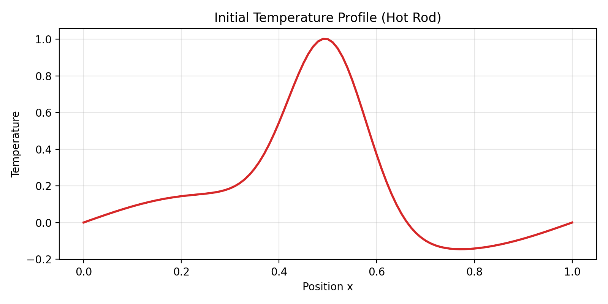

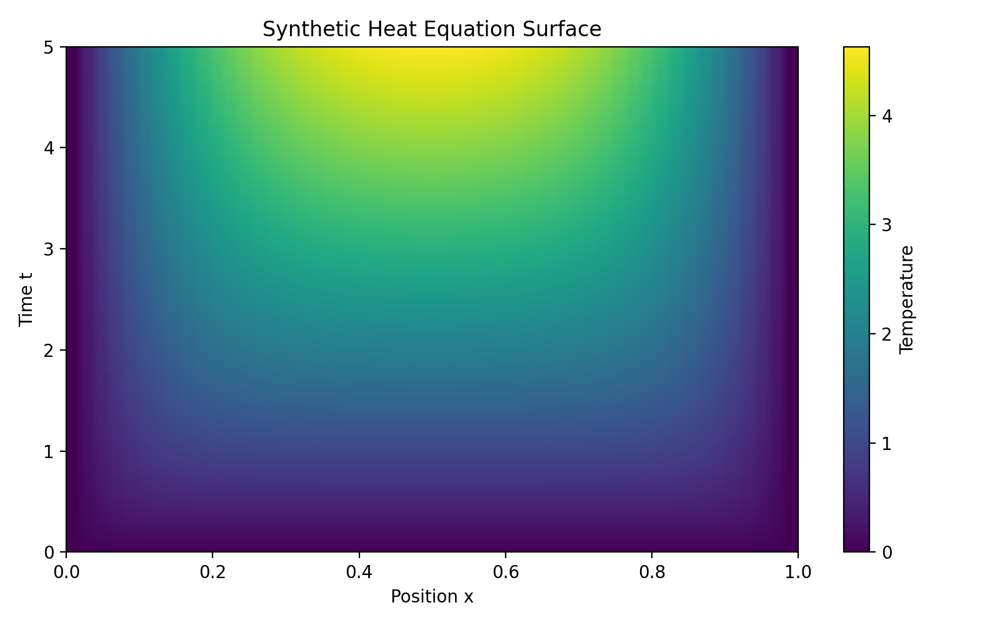

## Trading agent showdown

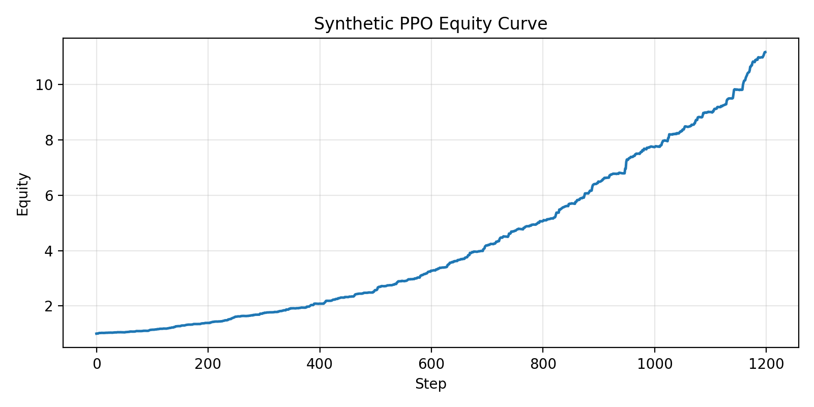
