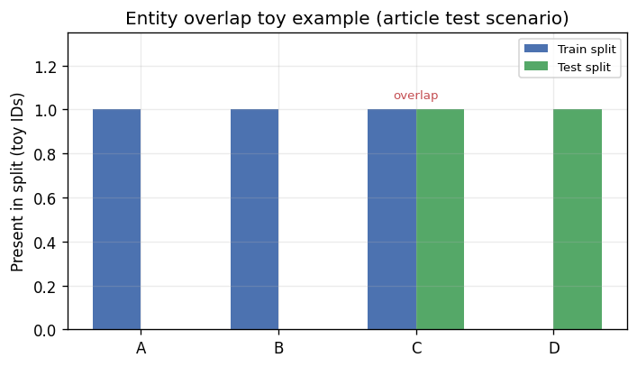
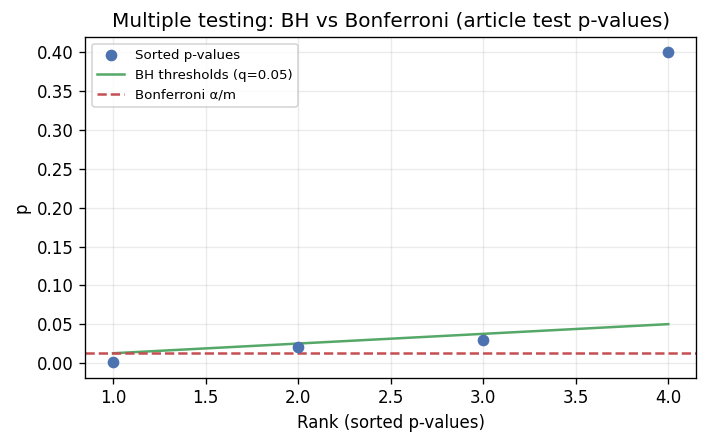

# Technical Writing + Scientific Python Articles

Technical articles spanning reproducible analysis projects across statistics,
machine-learning validation, scientific computing, and mathematical exposition.

The emphasis is on clear explanation, runnable code where possible, reusable
Python extracted from notebooks, and honest documentation of data and
reproducibility limits.

See [`docs/portfolio_report.md`](docs/portfolio_report.md) for an evidence-based
roll-up of article status, declared dependencies, data availability notes, and
notebook execution snapshots (generated metadata; not a fresh notebook run).

## Featured

- **Website:** [marcoheningtallarico.com](https://marcoheningtallarico.com/)
- **LinkedIn:** [Marco Hening Tallarico](https://www.linkedin.com/in/marco-hening-tallarico/)
- **Towards Data Science:** [Author Page](https://towardsdatascience.com/author/marco-hening-tallarico/)
- **Interview / media:** [Bridging research and readability (Towards Data Science)](https://towardsdatascience.com/bridging-the-gap-between-research-and-readability-with-marco-hening-tallarico/)

## External writing

Several projects here accompany technical articles on Towards Data Science. The
repository keeps the notebooks, `src/` helpers, and reproducibility notes behind
those pieces—not broad claims, but materials you can run and inspect.

- **Towards Data Science author page:** [Marco Hening Tallarico](https://towardsdatascience.com/author/marco-heningtallarico/)

| Flagship project | Published companion (URL from article README) |
| --- | --- |
| [Data Leakage Challenge](articles/data-leakage-challenge) | [Will You Spot the Leaks?](https://towardsdatascience.com/will-you-spot-the-leaks-a-data-science-challenge/) |
| [NASA Climate Data Pt. 1](articles/nasa-climate-data-pt1) | [How to Access NASA’s Climate Data (Pt. 1)](https://towardsdatascience.com/how-to-access-nasas-climate-data-and-how-its-powering-the-fight-against-climate-change-pt-1/) |
| [Bonferroni vs Benjamini–Hochberg](articles/bonferroni-vs-benjamini-hochberg) | [TDS companion (same URL as article README **Published URL**)](https://towardsdatascience.com/the-time-10-99-was-too-big-superheavy-elements-and-deceit/) |

## Best entry points

| Project | Start here if you want to see... | Signal |
| --- | --- | --- |
| [`articles/data-leakage-challenge`](articles/data-leakage-challenge) | ML validation and leakage-aware evaluation | split discipline, leakage checks, scikit-learn workflow |
| [`articles/nasa-climate-data-pt1`](articles/nasa-climate-data-pt1) | public-data analysis and reproducible EDA | API ingestion, cleaning, visualization |
| [`articles/bonferroni-vs-benjamini-hochberg`](articles/bonferroni-vs-benjamini-hochberg) | statistical reasoning and simulation | multiple testing, FDR/FWER tradeoffs |

## Verification snapshot

- Notebook execution: existing `docs/notebook_execution_report.json` reports **9 / 9** notebook entries marked `ok` (snapshot, not an on-demand run).
- Articles report: `docs/articles_report.md`, generated via `make articles-report` from repository metadata and existing artifacts.
- Lint and tests: run `make check` in your environment after `make install` for current Ruff and pytest results (counts change with the codebase).
- Caveat: re-run validation after dependency, notebook, or source changes (PEP 668 setups may require a virtual environment rather than system `pip`).

For an evidence-based summary of article status, dependencies, data availability,
and notebook execution snapshots, see [`docs/portfolio_report.md`](docs/portfolio_report.md).

Further detail: `docs/REPRODUCIBILITY.md`, `docs/DATA_POLICY.md`.

## Selected outputs

Static previews are generated from **repo-local fixtures and article tests** (not
claimed live API results or challenge leaderboard scores). Regenerate with
`MPLBACKEND=Agg make preview-assets` from the repo root, or run
`scripts/generate_docs_previews.py` directly with `MPLBACKEND=Agg` when needed.

| Project | Preview |
| --- | --- |
| [Data Leakage Challenge](articles/data-leakage-challenge) |  |
| [NASA Climate Data Pt. 1](articles/nasa-climate-data-pt1) |  |
| [Bonferroni vs Benjamini-Hochberg](articles/bonferroni-vs-benjamini-hochberg) |  |

**GitHub social preview:** optional Open Graph image at [`docs/assets/social-preview.png`](docs/assets/social-preview.png) (themes: technical writing, scientific Python, reproducible analysis). Settings and topic tags: [`docs/GITHUB_PROFILE_NOTES.md`](docs/GITHUB_PROFILE_NOTES.md).

## Reviewer guide

- **Hiring manager:** [Best entry points](#best-entry-points), [External writing](#external-writing), [Featured](#featured) (website, LinkedIn, TDS author page, interview), then [Project index](#project-index).
- **Data science reviewer:** [`articles/data-leakage-challenge`](articles/data-leakage-challenge) for leakage-aware validation and reusable overlap checks.
- **Scientific Python reviewer:** [`articles/nasa-climate-data-pt1`](articles/nasa-climate-data-pt1) for public-data ingestion, cleaning, and reproducible EDA helpers.
- **Statistics reviewer:** [`articles/bonferroni-vs-benjamini-hochberg`](articles/bonferroni-vs-benjamini-hochberg) for simulation-friendly FWER vs FDR tradeoffs.
- **Technical writing reviewer:** compare article READMEs and notebooks with [External writing](#external-writing) companions and the interview link under [Featured](#featured).

## Reusable Python

Several projects ship article-local `src/` helpers with coverage from the repo
test suite (`tests/` and article-local `tests/`):

- [`articles/bonferroni-vs-benjamini-hochberg/src/multiple_testing.py`](articles/bonferroni-vs-benjamini-hochberg/src/multiple_testing.py): Benjamini-Hochberg-style rejection logic shared with tests
- [`articles/data-leakage-challenge/src/leakage_guards.py`](articles/data-leakage-challenge/src/leakage_guards.py): entity-overlap leakage checks
- [`articles/nasa-climate-data-pt1/src/nasa_pt1_pipeline.py`](articles/nasa-climate-data-pt1/src/nasa_pt1_pipeline.py): climate frame export and preprocessing helpers

Other articles also include tested `src/` modules (`norms.py`, `sde_ou.py`,
`evaluation.py`, `pinn_heat.py`). The notebooks remain narrative artifacts;
logic that benefits from regression checks lives in Python modules alongside
them.

## What these articles cover

- Statistical reasoning through simulation and error-rate comparisons
- Leakage-aware machine-learning validation
- Public-data ingestion, cleaning, and exploratory analysis where documented
- Scientific Python workflows pairing notebooks with importable modules
- Mathematical and applied exposition for readers
- Repository hygiene: Makefile targets, Ruff, pytest, pre-commit, GitHub
  Actions, dependency inventories

## Project index

Status labels mirror each article README and notebook snapshot evidence.

| Project | Topic | Stack | Status | Signal |
| --- | --- | --- | --- | --- |
| [`articles/bonferroni-vs-benjamini-hochberg`](articles/bonferroni-vs-benjamini-hochberg) | multiple testing tradeoffs | NumPy, matplotlib | runnable | statistical simulation |
| [`articles/data-leakage-challenge`](articles/data-leakage-challenge) | leakage-aware ML validation | pandas, seaborn | runnable | leakage-aware evaluation |
| [`articles/nasa-climate-data-pt1`](articles/nasa-climate-data-pt1) | climate API ingestion | requests, pandas | runnable | reproducible EDA |
| [`articles/nasa-climate-data-pt2-sdes`](articles/nasa-climate-data-pt2-sdes) | SDE temperature modeling | SciPy, statsmodels | runnable | stochastic modeling |
| [`articles/grammar-as-injectable-nlp`](articles/grammar-as-injectable-nlp) | grammar and NLP exposition | Jupyter scaffolding | pending migration | conceptual NLP framing |
| [`articles/point-to-l-infinity`](articles/point-to-l-infinity) | Lp norms for ML intuition | sklearn, seaborn | runnable | mathematical exposition |
| [`articles/trading-agent-showdown`](articles/trading-agent-showdown) | RL trading experiment | SB3, torch, pandas | runnable | RL experiment framing |
| [`articles/physics-informed-neural-networks`](articles/physics-informed-neural-networks) | PINNs for inverse PDE setups | DeepXDE, TensorFlow | runnable | scientific ML setup |

## Recommended review paths

**Data science / ML:**\
[`data-leakage-challenge`](articles/data-leakage-challenge) → [`nasa-climate-data-pt1`](articles/nasa-climate-data-pt1) → [`bonferroni-vs-benjamini-hochberg`](articles/bonferroni-vs-benjamini-hochberg)

**Scientific computing / quantitative:**\
[`nasa-climate-data-pt1`](articles/nasa-climate-data-pt1) → [`nasa-climate-data-pt2-sdes`](articles/nasa-climate-data-pt2-sdes) → [`physics-informed-neural-networks`](articles/physics-informed-neural-networks)

**Technical writing / research:**\
[`bonferroni-vs-benjamini-hochberg`](articles/bonferroni-vs-benjamini-hochberg) → [`point-to-l-infinity`](articles/point-to-l-infinity) → [`grammar-as-injectable-nlp`](articles/grammar-as-injectable-nlp)

## Technical stack

- **Python / data:** Python, pandas, NumPy, requests
- **Statistics / modeling:** SciPy, statsmodels, multiple-testing procedures
- **Machine learning:** scikit-learn, stable-baselines3, TensorFlow, DeepXDE, torch
- **Visualization:** matplotlib, seaborn
- **Quality / reproducibility:** pytest, Ruff, pre-commit, Makefile, GitHub Actions
- **Languages / formats:** Python, Markdown, Jupyter notebooks, YAML, JSON,
  Makefile targets, documented shell-style commands from the Makefile,
  mathematical notation aligned with typical LaTeX usage in articles

See [`docs/dependency_inventory.md`](docs/dependency_inventory.md) for the
full package and language inventory.

## Reproduce

From the repository root (use a virtual environment where system Python blocks
plain `pip install`, then point `PYTHON` at that interpreter):

```bash
make install
make install-articles
make check
make notebook-status
make articles-report
make portfolio-report
```

To refresh README preview images and the social banner: `MPLBACKEND=Agg make preview-assets` (non-interactive matplotlib).

`make check` runs linting (`ruff check`) and the pytest suite.
`make notebook-status` pretty-prints `docs/notebook_execution_report.json`; it
does not execute notebooks fresh.
`make articles-report` refreshes `docs/articles_report.md`.
`make portfolio-report` refreshes `docs/portfolio_report.md` from the same
metadata sources (still no notebook execution).

Per article, when debugging one piece in isolation:

- `pip install -r articles/<article-slug>/requirements.txt`

Reference docs:

- `docs/REPRODUCIBILITY.md`
- `docs/DATA_POLICY.md`
- `docs/LICENSE_NOTES.md`
- `docs/GITHUB_PROFILE_NOTES.md` (optional GitHub description, topics, social preview)

## Status labels

- **runnable**: executable materials are present and documented for the current
  repo state
- **partial**: core materials exist, but data, environment, or execution
  assumptions remain
- **in progress**: concept or implementation is still evolving
- **pending migration**: older article awaiting migration into the current repo
  structure

## Data policy

Article READMEs document whether data is public, generated, excluded, or pending
migration. Large, private, restricted, or provenance-sensitive data is not
committed unless appropriate. Status labels stay conservative about what can be
reproduced from the repository alone.

## Scope

This repository holds technical writing and reproducible analysis articles,
not a production package. Some projects run as companions to published
articles; others are staged for migration or depend on upstream APIs and
compute. The README favors accurate status over broad claims.

## Repository layout

```text
.
├── articles/                  # article-specific notebooks, src helpers, data notes
├── shared/                    # cross-article reusable modules
├── tests/                     # repository-level pytest suite
├── docs/                      # reproducibility and reporting documentation
├── scripts/                   # automation scripts (report generation, utilities)
├── data/                      # shared data notes and optional artifacts
├── Makefile                   # install/check/report commands
└── pyproject.toml             # lint/test configuration
```
